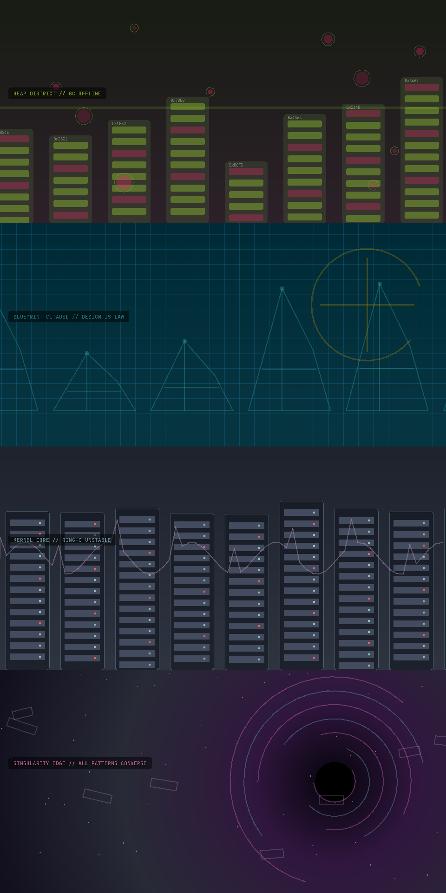

# 🔥 Merge Hell Runner

> **"The only IDE plugin where `rm -rf /` is a valid survival strategy."**

[](https://plugins.jetbrains.com/plugin/29132-merge-hell-runner)
[](https://plugins.jetbrains.com/plugin/29132-merge-hell-runner)

**Merge Hell Runner** is a hardcore side-scrolling survival game running directly inside your IntelliJ IDEA.

Tired of fixing merge conflicts? Exhausted by memory leaks? **Don't fix them. Jump over them.** Turn your coding stress into high-octane parkour gameplay.

---

## 🎮 World Preview



> *Each post-opening mission has its own scenery language, color rhythm, and environmental hazards.*

---

## 🚀 Features v1.0.0: The Campaign Release

Version 1.0.0 turns the endless runner into a **full 5-level campaign** — distinct worlds, arena survival, and a handcrafted boss waiting at the end of every route.

* **🗺️ 5-Level Campaign**: Run through **Repository City → Heap District → Blueprint Citadel → Kernel Core → Singularity Edge**. The opening mission evolves across five biomes; every later mission has its own architecture, route layout, and atmosphere.
* **👹 5 Unique Bosses**: Break the dependency graph of the **Legacy Code Monstrosity** (⚠️), survive **Memory Leak Daemon** (💀), outmaneuver **The Architect** (👑), interrupt **Kernel Panic Overlord** (💀), and face the adaptive **Singularity Engine** (☠️). Each encounter has three stages and its own attacks, summons, silhouette, and HUD identity.
* **🧬 Level-Specific Enemies**: Heap **Leaks**, precision **Sentinels**, ring-0 **Interrupts**, and adaptive **Mirrors** join different formations in each mission before converging in the finale.
* **🌊 Arena Battle Zones**: Get locked into an arena and clear relentless enemy waves — **Rush**, **Sniper**, and **Mini-Boss** formations — before the gates reopen.
* **🔫 6-Weapon Arsenal**: Swap between `git push`, spread-fire `git push -f`, rapid `git commit -a`, the devastating `rm -rf /`, flaming `git blaze`, and the screen-clearing `sudo rm -rf /` laser.
* **⚡ Sudo Mode**: Pick up the Golden Thunderbolt to gain **ROOT ACCESS** and blast everything on screen with a spread-shot barrage.
* **🛡️ Defense Matrix**: Equip the Shield (🛡️) to survive one fatal `NullPointerException`, and grab ❤️ health drops to stay alive.
* **🪙 Coins & Leaderboard**: Collect coins mid-run and chase your **Top 5 high scores**, saved locally in your IDE.
* **🎹 Combo System**: Chain kills to rack up multipliers and inflate your score.
* **📺 Retro Visuals**: Immersive CRT scanline filter, parallax code rain, and floating combat text that reads like a hacker's terminal.

---

## 🕹️ Controls

| Key | Action | Description |
| :--- | :--- | :--- |
| **Space** | `Jump` | Press once to jump. **Press again in mid-air for Double Jump.** |
| **Enter** | `Start / Jump` | Start a run from the briefing, or jump during a run. |
| **C** | `Commit / Shoot` | Fire code projectiles to debug enemies. |
| **← / →** | `Move` | Dodge left and right. |
| **Shift** | `Dash` | Dash through danger; briefly grants invulnerability. |
| **X** | `Melee` | Strike nearby enemies. |
| **Z** | `Weapon` | Cycle weapons; on the title screen, choose a starting weapon. |
| **B** | `Bomb` | Trigger the emergency screen clear. |
| **1** / **2** / **3** | `Upgrade` | Choose an upgrade when a draft appears. |
| **R** | `Reroll` | Reroll the current upgrade draft when available. |
| **P** / **Esc** | `Pause` | Pause the game (and pretend you're working). |

### Lab Mode

Lab Mode is a QA shortcut system. Press **F12** or **T** to enable it; the current run is
then permanently marked **unranked**. Use **H** for supplies, **U** for an upgrade draft,
**J** for the next encounter, **K** to clear the current wave, and **L** to arm the boss
gate. Press **N** to start a fresh ranked run with Lab Mode disabled.

---

## 👾 The Bestiary (Enemies)

Know your enemy to survive the sprint:

* 🐛 **Bug**: The classic pest. Small, annoying, everywhere.
* 🔥 **Firewall**: Tall barrier. You can't jump over it; you must shoot it down.
* 🔒 **Deadlock**: Floating locks that try to freeze your progress.
* 💥 **Crash**: Fast-moving explosive runtime errors.
* 🧱 **TechDebt**: Massive blocks of code that hurt you if you touch them.
* 🧠 **Leak**: Retained heap objects that drift and multiply pressure.
* 🎯 **Sentinel**: Long-range design enforcers with accurate telegraphed shots.
* ⚡ **Interrupt**: Fast, jagged ring-0 attackers that commit to sudden charges.
* 🪞 **Mirror**: Finale enemies that combine durability, movement, and ranged pressure.

---

## 🛠️ Installation & Development

### Prerequisite
* IntelliJ IDEA (2023.2 or later recommended)
* JDK 17

### Run from Source
1.  Clone this repository.
2.  Open the project in IntelliJ IDEA.
3.  Run the Gradle task:
    ```bash
    ./gradlew runIde
    ```

### Install Plugin (Manual)
1.  Build the plugin: `./gradlew buildPlugin`
2.  Go to IDEA `Settings` -> `Plugins` -> `⚙️` -> `Install Plugin from Disk...`
3.  Select `build/distributions/merge-hell-runner-1.0.0.zip` without extracting it.

For release engineering instructions, see [RELEASING.md](RELEASING.md). For the full
1.0.0 change list, see [CHANGELOG.md](CHANGELOG.md).

---

## 📸 Screenshots

| Boss Fight | Start Screen |
| :---: | :---: |
|  |  |

---

## 👨‍💻 Author

Crafted with ❤️, ☕, and a lot of `git merge --abort` by **Phil Zhang**.

* 🌍 **Portfolio:** [HomePage](https://phil-the-guy.netlify.app/)
* 📧 **Contact:** bigphil.zhang@qq.com

---

## 🤝 Contributing

Pull Requests are welcome! If you find a bug (in the game, not the enemies), please open an issue.

1.  Fork the Project
2.  Create your Feature Branch (`git checkout -b feature/NewBoss`)
3.  Commit your Changes (`git commit -m 'Add new Boss: The Microservice'`)
4.  Push to the Branch (`git push origin feature/NewBoss`)
5.  Open a Pull Request

---

*Enjoy the game, and may your build always succeed!*
