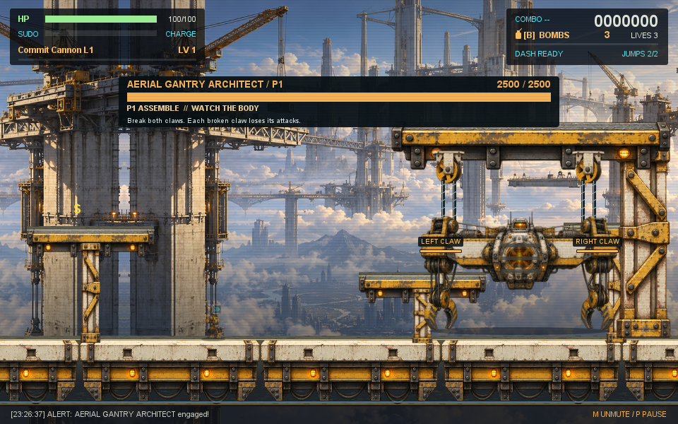
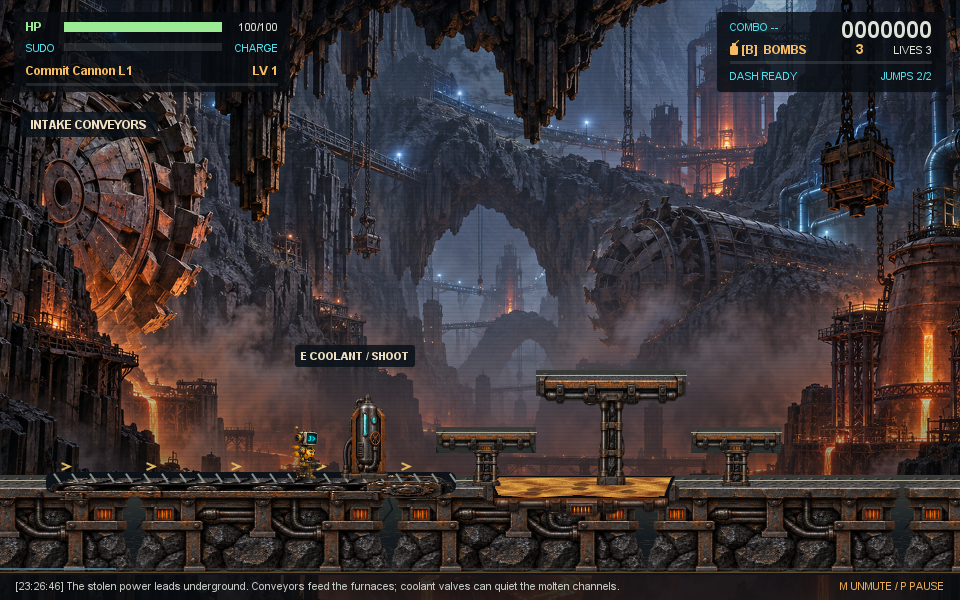
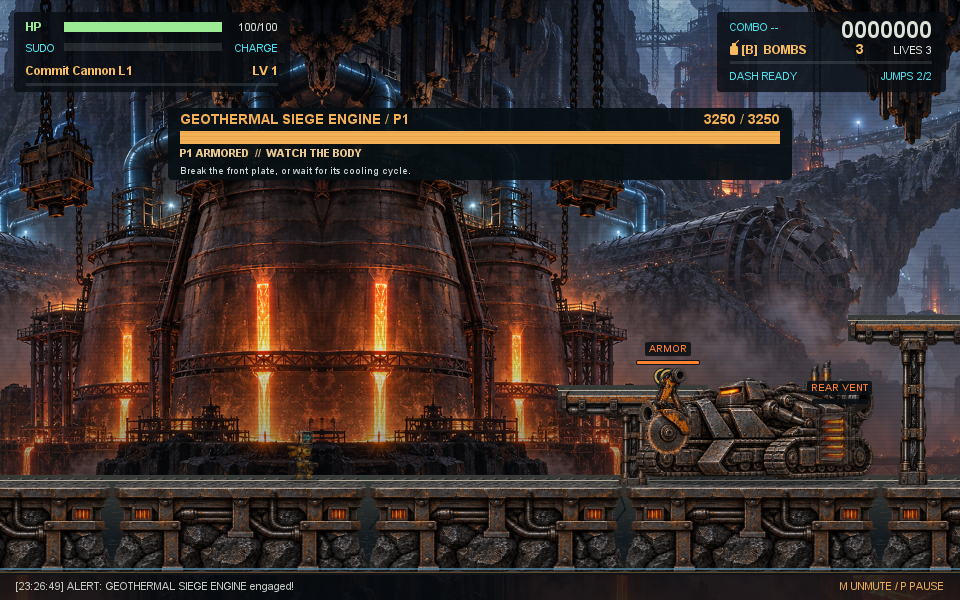
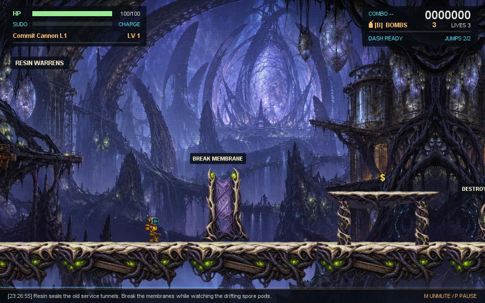
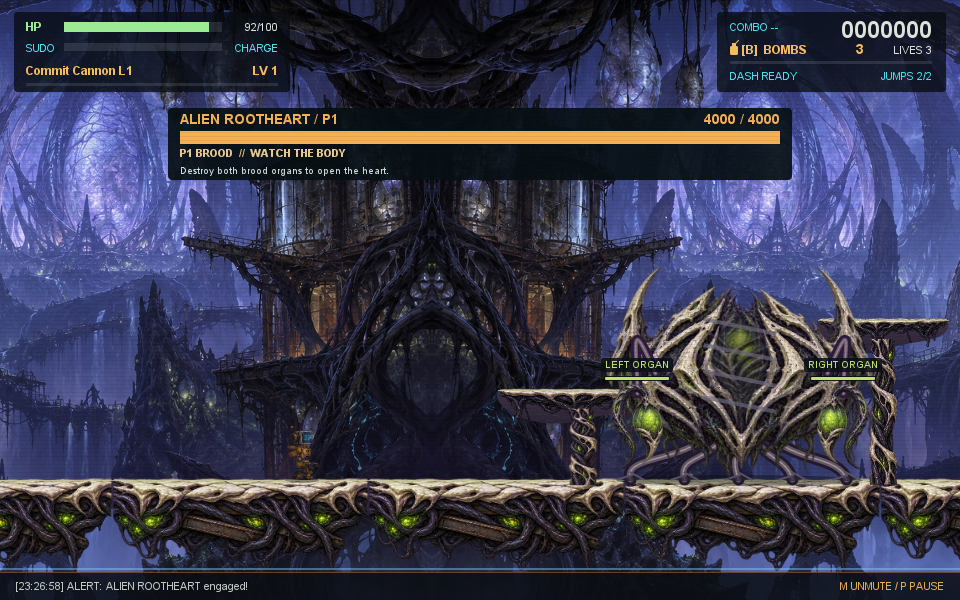

# 五章精制版整合验收 · 2026-09-14

本轮完成第三至第五章整体重制，保留前两章的工业废都与内存管道基准。后续章节各有自己的全景、前景地形、三种专属敌人、物理路线和多部件首领，五章形成从工业城市到异星巢穴的连续战役。

本地安装包：[`merge-hell-runner-1.0.0.zip`](../../build/distributions/merge-hell-runner-1.0.0.zip)。大小 **29,510,852 字节**，SHA-256：

```text
bd766ae2c9c243eaca75ee88e1714d89b87243a389e83a8a6da705b9f05225fe
```

包已通过 Gradle `build buildPlugin verifyPlugin`，包含与工作区逐字节一致的42份未补丁资源、9张新章节图集/全景及完整新控制器。Gradle补丁后的插件说明、版本和新章节名称另行校验。没有发布到 Marketplace，也没有操作用户的日常 IDE 安装目录。

## 章节内容

| 章节 | 场景与路线 | 敌人与首领 |
| --- | --- | --- |
| 仓库废都 | 保留工业城市、多段环境、积水与可破设施 | 初始敌群与遗留代码巨兽节点拆解 |
| 内存沼泽 | 保留泄漏管道、净化站与净化/回收选择 | 泄漏生态与内存泄漏恶魔 |
| 天穹城塞 | 金色高空城、四段断桥、真实承载的升降台、可射击配重 | 轨道哨兵、盾卫、缆索黄蜂；龙门架首领左右机械爪独立损毁、攻击取消、核心暴露与重建 |
| 地热铸炉 | 黑岩洞穴、运输带、熔岩槽、冷却罐和周期蒸汽 | 焊接飞行器、地热钻虫、熔渣爬行炮；攻城钻机的前甲、后方散热口、过热核心、冲锋与抛射熔弹 |
| 异星根巢 | 被活体侵占的设施、酸潭、树根平台、实体膜墙和有限孵化巢 | 树脂喷吐者、孢子水母、扑猎者；双器官与触须、孵化援军、器官重生、脱壳后的移动心脏 |

三章各有一张全景、一张角色部件图集、一张地形图集，共36个透明部件。原始生成图、提示词、导出脚本与素材来源见[美术记录](../design/evolution/chapter-premium-art.md)。敌人有各自的移动、护甲、蓄力、攻击轨迹和反制时机。地图危险区、平台、Boss部件命中框与可见实体使用同一模拟状态。

最终视觉审查修正了熔岩形状过于规整、冷却管悬空、首领吊架材质偏平的问题。异星膜墙恢复原始素材比例，并将实体宽度同步调整为96像素；从两侧行走、冲刺、双跳越过与复活脱离重叠均通过回归。

## 实际游戏画面

以下直接来自 Swing `GamePanel.paint`，使用明确的章节、位置与战斗姿态夹具，未经图像合成或修饰。截图用来检查构图和显示，战斗可完成性由后面的正常输入探针验证。











## 验证结果

- **110个测试套件、712项测试：零失败、零错误、零跳过。** 覆盖全战役推进、最终结算、暂停和升级冻结、复活、检查点、双语、默认静音、伤害反馈、无人机、六种武器和弹丸预算。
- 三章新增180张场景截图：每章15种场景，中文/英文，960×600/600×400。包括路线、专属敌群、蓄力、进场、三阶段与部件损毁。状态记录为72张路线、12张进场预警、96张战斗，全部关闭LAB且玩家生命大于零。
- 加上68张通用界面截图，共 **248个场景通过最终绘制文字的语言审计**；未发现界面混用。代码语法、按键名是审计明示允许的字面量。
- 重点检查了54组武器/部件扫掠、18组暴露核心、无人机追踪独立部件、空白间隙穿弹、部件击破、预警与实际伤害范围。实际扣血与反馈数值一致，持续接触的无敌帧不会重复闪屏。
- 修正共享测试工具的按键释放：持续方向/射击现在由真实`*_R`释放，避免测试把“逻辑持续按下”与“物理按键已释放”混在一起。完整回归在修正后的工具上通过。

构建与原始数字见[构建日志](data/2026-09-14-chapter-overhaul/gradle-release.log)、[资源和源码校验清单](data/2026-09-14-chapter-overhaul/release-manifest.json)、[语言审计](data/2026-09-14-chapter-overhaul/language-audit.txt)。

## 正常输入路线与首领战

最终路线探针对全部随机流固定种子，执行真实方向、跳跃、冲刺、射击、有限炸弹与正常升级选择；入口夹具只选章节和配置。进入后保留自然敌人、掉血和资源消耗。每次上限14,000模拟步；机器人在战斗中停滞600步可按B消耗现有炸弹。

| 配置 | 第三章路线 | 第四章路线 | 第五章路线 |
| --- | --- | --- | --- |
| 基础 | 4,992步抵达；61生命/2条命/1弹 | 6,172步抵达；50生命/3条命/0弹 | 4,732步抵达；63生命/2条命/0弹 |
| 升级 | 3,537步抵达；28生命/3条命/0弹 | 4,487步抵达；88生命/3条命/2弹 | 3,474步抵达；11生命/3条命/1弹 |

首领探针从对应正常入口、100生命、3条命、3枚炸弹开始，完整等待预警与进场。基础配置使用提交炮；升级配置在入口应用8项合法升级。战斗中没有无敌、伤害注入、强制部件状态、瞬移或清场。机器人读取真实部件位置与预警范围规划正常输入，每次上限18,000模拟步。

| 配置 | 第三章首领 | 第四章首领 | 第五章首领 |
| --- | --- | --- | --- |
| 基础 | 2,263步击败；40生命/3条命 | 2,294步击败；80生命/3条命 | 10,107步击败；30生命/2条命 |
| 升级 | 1,926步击败；50生命/3条命 | 1,664步击败；80生命/3条命 | 5,153步击败；10生命/3条命 |

基础第五章首领战经历实际死亡与复活，仍成功击败，未发生死器官导致无法继续的软锁。记录包括阶段、部件、预警、移动、伤害与孵化援军。

[最终路线轨迹和策略](data/2026-09-14-chapter-overhaul/playthrough-release/README.md) · [首领战轨迹和策略](data/2026-09-14-chapter-overhaul/boss-playthrough-v1/README.md)。更早一轮路线证据的战斗随机流未完整固定，且基础第四章受机器人平台寻路限制停滞；旧记录附有说明，最终六组使用修正后的完整种子和公开策略。

路线和首领使用独立入口。以上证明各路线和首领可由正常输入完成，战役衔接另由回归验证；人工连续通关和主观难度评价尚未测量。

## 渲染开销

本机Java17、headless Java2D，真实逻辑帧渲染。每组40帧预热、160帧采样；三章×两种窗口尺寸×0/6/24敌人，共18组。负载同时加入友方和敌方投射物。常规组每类专属敌人均出现；高负载组用于检查资源与绘制成本。

| 章节 | 6敌人组 p95（两尺寸范围） | 24敌人组最高 p95 |
| --- | --- | --- |
| 天穹城塞 | 4.781–7.800ms | 8.620ms |
| 地热铸炉 | 4.844–5.429ms | 11.135ms |
| 异星根巢 | 5.008–5.058ms | 8.688ms |

这些是离屏渲染时间，不包含原生IDE调度、窗口合成、输入延迟或整条游戏循环，不能直接换算为实玩帧率。没有在用户IDE进行人工试玩。默认静音及声音/音乐设置保持原有行为。

[原始性能CSV](data/2026-09-14-chapter-overhaul/render-performance.csv) · [探针源码](../../src/test/java/com/bigphil/mergehell/ChapterRenderBenchmark.java)。

## 重现

Windows下将`JAVA_HOME`指向Java17，以当前已缓存的Gradle依赖运行：

```powershell
$env:GRADLE_USER_HOME = "$PWD/.gradle/evolution-user-home"
$env:CI = 'true'
./gradlew.bat build buildPlugin verifyPlugin --offline --no-daemon --console=plain --init-script build/singularity-verification/isolated-sandbox.init.gradle
```

`LanguagePreview`、`ChapterCampaignPreview`、`ChapterPlaythroughProbe`、`ChapterBossPlaythroughProbe`和`ChapterRenderBenchmark`均保留于测试源码。需要Java17、项目类/资源、IntelliJ SDK依赖与JUnit运行类路径。各探针入口预算及夹具在对应源码和证据说明中给出。全量图像保留在`build/chapter-overhaul/previews-final`及`common-previews`，精选图、原始CSV、日志与SHA校验值归档于本文数据目录。
